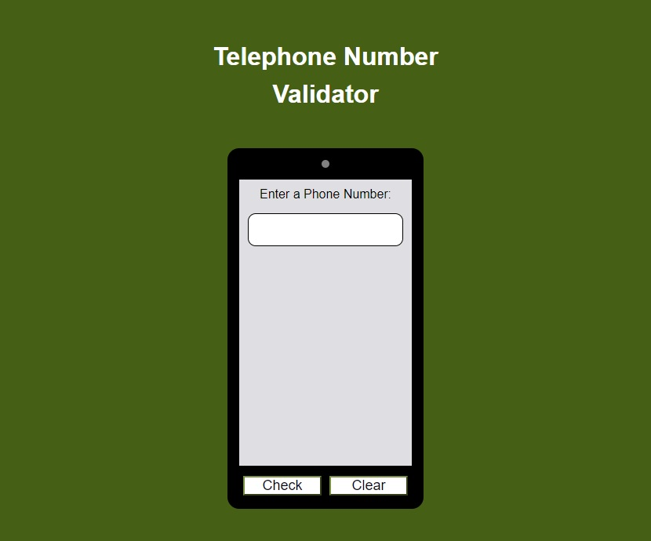

# telephone_number_validator-freecodecamp
JavaScript Algorithms and Data Structures Certification Project 
Telephone Number Validator 
An application that check if a number is a valid United States phone number

[freeCodeCamp](https://www.freecodecamp.org/learn "Earn free verified certifications with freeCodeCamp's core curriculum")

