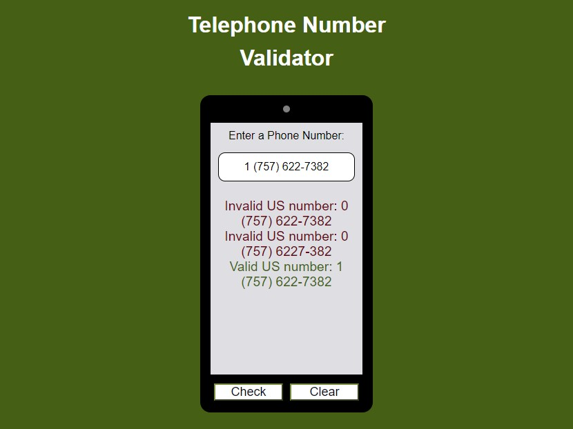

# telephone-number-validator
freeCodeCamp JavaScript Algorithms and Data Structures Certification Project
 Telephone Number Validator
 An application that check if a number is a valid United States phone number

Browse: <https://cemcelikgh.github.io/telephone-number-validator/>

