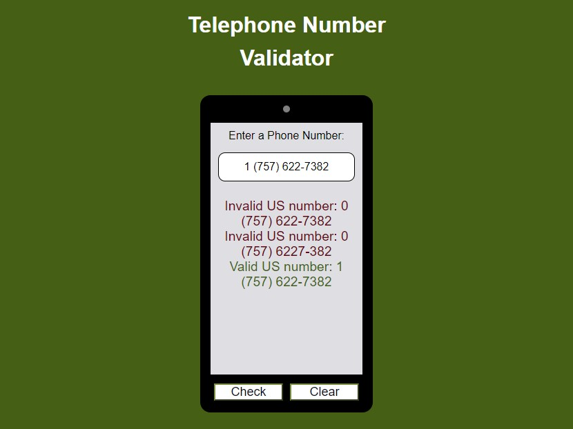

# telephone-number-validator
freeCodeCamp JavaScript Algorithms and Data Structures Certification Project
 Telephone Number Validator
 An application that check if a number is a valid United States phone number

Browse: <https://usa-phone-number-validator.netlify.app/>

